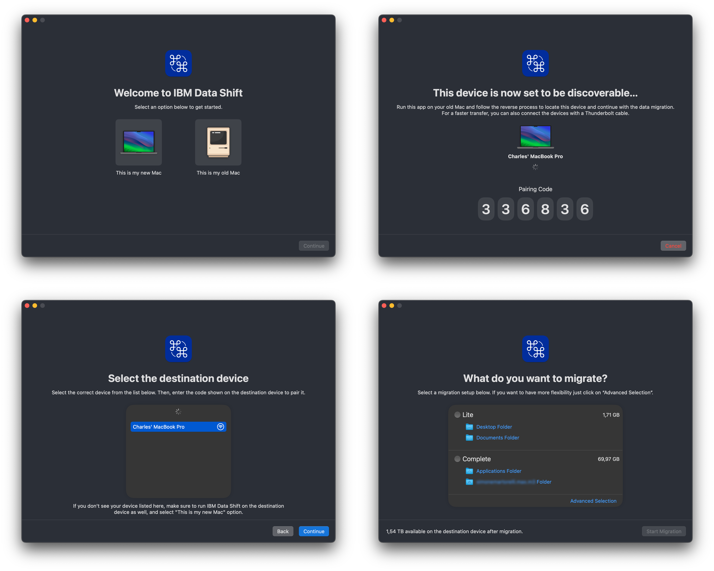

# IBM Data Shift


## Overview

**IBM Data Shift** is a native macOS application designed to streamline the migration of user data from an old Mac to a new Mac. Built with SwiftUI, it provides an intuitive, guided experience for transferring files, applications, preferences, and settings over a direct peer-to-peer network connection.



## As seen on

[JNUC 2024 Session 1077](https://www.youtube.com/watch?v=S_exJoiVb20)  
[University of Utah, MacAdmins Meeting, June 2025](https://stream.lib.utah.edu/index.php?c=details&id=13705)  

## Key Features

### 🚀 **Seamless Data Migration**
- Transfer user files, applications, preferences, and settings between Macs
- Support for both **Wi-Fi** and **Thunderbolt** direct connections
- Automatic peer-to-peer network discovery using Bonjour (DNS-SD)
- Real-time progress tracking with time estimation

### 🔒 **Enterprise-Ready**
- Integration with **Jamf Pro** for managed environments
- MDM enrollment verification and environment detection
- Automated inventory updates post-migration
- Configurable via MDM profiles (UserDefaults)

### ⚙️ **Highly Customizable**
- Extensive configuration options through UserDefaults
- Custom branding support (organization name, icons, colors)
- Configurable file inclusion/exclusion rules
- Flexible duplicate file handling policies
- Optional Terms & Conditions acceptance flow

### 📊 **Advanced File Management**
- Intelligent file discovery with customizable filters
- Support for symbolic links preservation
- Duplicate file detection and handling
- Optional migration report generation
- Memory-optimized for large data transfers

### 🌍 **Localization Support**
- Multi-language support via `Localizable.xcstrings`
- Accessible UI with comprehensive VoiceOver support

## System Requirements

- **macOS**: 12.0 (Monterey) or later
- **Swift**: 5.9.0 or later
- **Xcode**: 14.0 or later (for building from source)
- **Network**: Wi-Fi or Thunderbolt connection between devices
- **Permissions**: Full Disk Access required for complete data migration

## How It Works

1. **Device Discovery**: Launch the app on both the source (old) and destination (new) Mac
2. **Connection**: Devices automatically discover each other over the local network
3. **Verification**: Secure pairing with verification code
4. **Configuration**: Choose migration options (Lite, Complete, or Advanced)
5. **Transfer**: Files are transferred directly between devices with real-time progress
6. **Completion**: Optional post-migration steps (Apple ID verification, Jamf recon, device restart)

## Installation

### Pre-built Release
Download the latest release from the [Releases](../../releases) page.

### Building from Source

1. Clone the repository:
```bash
git clone https://github.com/IBM/mac-ibm-migration-tool.git
cd mac-ibm-migration-tool
```

2. Open the project in Xcode:
```bash
open migrator.xcodeproj
```

3. Rebrand the app:
   - Follow the [wiki guide](../../wiki/How-to-rebrand-the-app).

4. Build and run:
   - Select the `migrator` scheme
   - Choose your target device
   - Press `Cmd + R` to build and run

## Configuration

IBM Data Shift can be extensively configured via MDM profiles or local UserDefaults. Key configuration options include:

### Basic Settings
- `orgName`: Organization name for branding (default: "IBM")
- `networkServiceIdentifier`: Bonjour service identifier (default: "_migrator")
- `skipMDMCheck`: Skip device management verification (default: false)

### Migration Behavior
- `duplicateFilesHandlingPolicy`: How to handle duplicate files (`skip`, `replace`, `move`)
- `backupPath`: Path for duplicate file backups (default: "~/Desktop/Migration.Backup")
- `skipDeviceReboot`: Skip post-migration reboot prompt (default: false)
- `generateReport`: Generate migration report on desktop (default: false)

### File Filtering
- `excludedPathsList`: Array of paths to exclude from migration
- `allowedPathsList`: Array of paths to explicitly include
- `excludedFileExtensions`: Array of file extensions to skip
- `excludedFilePrefixes`: Array of file name prefixes to skip

### Jamf Integration
- `mdmEnvironments`: Array of managed environments with server URLs and recon policy IDs
- `skipJamfRecon`: Skip Jamf inventory update (default: false)
- `jamfReconMethod`: Method for running recon (`selfServicePolicy` or `binary`)
- `storePath`: Path to Jamf Self Service app

### UI Customization
- `welcomePageIcon`: Custom icon for welcome page
- `browserPageIcon`: Custom icon for browser page
- `setupPageIcon`: Custom icon for setup page
- Custom icons available for all app pages

For detailed configuration options, check project's [wiki](../../wiki).

## Usage

### For End Users

1. **Prepare both Macs**:
   - Ensure both devices have Wifi ON or connected via Thunderbolt
   - Grant Full Disk Access to the app when prompted
   - Keep both devices powered and awake during migration

2. **Launch the app** on both the source and destination Mac

3. **Follow the guided workflow**:
   - Device discovery and pairing
   - Migration option selection
   - File transfer with progress tracking
   - Post-migration steps (if configured)

### For Administrators

Deploy the app via your MDM solution with a configuration profile containing your desired settings. Example profile keys:

```xml
<key>orgName</key>
<string>Your Organization</string>
<key>skipMDMCheck</key>
<false/>
<key>duplicateFilesHandlingPolicy</key>
<string>move</string>
```

See the [wiki](../../wiki/App-Custom-Settings) for detailed deployment guides and configuration examples.

## Architecture

The app is built with a modular architecture:

- **SwiftUI Views**: Modern, declarative UI components
- **Network Layer**: Custom protocol over Network.framework for peer-to-peer communication
- **Migration Controller**: Orchestrates the file transfer process
- **Device Management**: Integration with macOS MDM APIs
- **Logging**: Comprehensive logging system with configurable verbosity

Key components:
- [`MigrationController.swift`](migrator/Controllers/MigrationController.swift): Core migration logic
- [`NetworkBrowser.swift`](migrator/Controllers/NetworkControllers/NetworkBrowser.swift): Device discovery
- [`NetworkServer.swift`](migrator/Controllers/NetworkControllers/NetworkServer.swift): Server-side networking
- [`NetworkConnection.swift`](migrator/Controllers/NetworkControllers/NetworkConnection.swift): Client-side networking
- [`AppContext.swift`](migrator/AppContext.swift): Centralized configuration management

## Contributing

We welcome contributions! Please see our [Contributing Guidelines](CONTRIBUTING.md) for details on:
- Code of conduct
- Development workflow
- Pull request process
- Coding standards

### Quick Start for Contributors

1. Fork the repository
2. Create a feature branch (`git checkout -b feature/amazing-feature`)
3. Make your changes
4. Run tests and SwiftLint
5. Commit your changes (`git commit -am 'Add amazing feature'`)
6. Push to the branch (`git push origin feature/amazing-feature`)
7. Open a Pull Request

## Security

For security concerns, please see our [Security Policy](docs/SECURITY.md).

## Changelog

See [CHANGELOG.md](CHANGELOG.md) for a detailed history of changes and releases.

## Support

- **Issues**: Report bugs or request features via [GitHub Issues](../../issues)
- **Community**: Join the `#mac-ibm-open-source` channel in the [MacAdmins Slack](https://www.macadmins.org)
- **Maintainers**: See [MAINTAINERS.md](MAINTAINERS.md) for contact information

## License

This project is licensed under the Apache License 2.0 - see the [LICENSE](LICENSE) file for details.

All source files must include the following copyright and license header:

```text
//
// © Copyright IBM Corp. 2023, 2025
// SPDX-License-Identifier: Apache2.0
//
```

## Acknowledgments

- Built by the Mac@IBM team
- Powered by Apple's Network.framework for peer-to-peer connectivity
- Designed for enterprise macOS environments

---

**Note**: This tool is specifically designed for macOS environments and requires appropriate permissions for full functionality. Always test in a non-production environment before deploying to end users.
